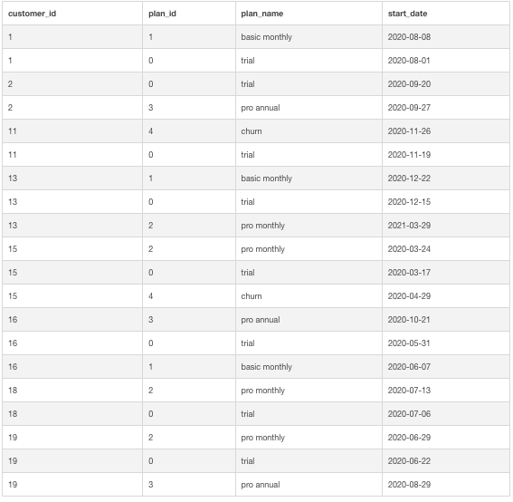

# Case Study #3 - Foodie-Fi

Foodie-Fi is the first case study in the 8-week SQL challenge. Please note that all information for this task is from:
https://8weeksqlchallenge.com/case-study-3/

## Problem Statement

Danny wanted to create a new streaming service that only had food related content - something like Netflix but with only cooking shows! He finds a few smart friends to launch his new startup Foodie-Fi in 2020 and started selling monthly and annual subscriptions, giving their customers unlimited on-demand access to exclusive food videos from around the world!

Danny created Foodie-Fi with a data driven mindset and wanted to ensure all future investment decisions and new features were decided using data. This case study focuses on using subscription style digital data to answer important business questions.

Danny has shared 2 key datasets for this case study: <br/>
• plans  <br/>
• subscriptions <br/>

## A. Customer Journey

Based off the 8 sample customers provided in the sample from the subscriptions table, write a brief description about each customer’s onboarding journey.

I needed to first join the sample table with the plans table to retrieve the plan name that each customer was on.

<br/>

```sql
SELECT
  s.customer_id,
  p.plan_id, 
  p.plan_name,  
  s.start_date
FROM foodie_fi.plans as p
JOIN foodie_fi.subscriptions AS s
  ON p.plan_id = s.plan_id
WHERE s.customer_id IN (1,2,11,13,15,16,18,19)
ORDER BY s.customer_id ASC;
```
### Table:

<br/>
  
  <br>
</p>
<br/>

Based on the results above, I have selected three customers to focus on and will describe their onboarding journey.

#### Customer 1:


